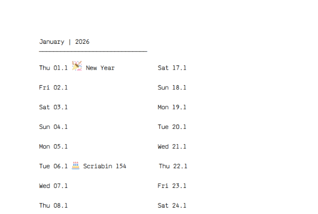

# Bullet Journal Creator



A small Python tool that generates a printable yearly bullet journal as a PDF. It creates a front page, monthly overview and notes pages, weekly planning pages, and then merges everything into one `bullet_journal.pdf` file.

## Technologies

- Python
- ReportLab
- pypdf
- Pillow
- python-dateutil

## Features

- Generates a complete journal for a selected year
- Includes monthly and weekly calendar pages
- Supports English and German labels
- Adds configurable birthdays, holidays, anniversaries, and icons
- Exports the journal as an A4 PDF

## Installation

Clone or download the project, open a terminal in the project folder, and create a virtual environment:

```bash
python3 -m venv .venv
source .venv/bin/activate
pip install -r requirements.txt
```

On Windows, activate the environment with:

```bash
.venv\Scripts\activate
```

## Create the Bullet Journal

Run the script from the project root:

```bash
python3 main.py
```

This creates a bullet journal for the default year `2026`.

To generate a journal for another year, pass the year as an argument:

```bash
python3 main.py 2027
```

The generated file is saved as:

```text
bullet_journal.pdf
```

Intermediate monthly and weekly PDF files are stored in the folders `inlay_month`, `inlay_week`, and `inlay_front`.

## Customization

Open `constants.py` to adjust the journal content.

Change the language:

```python
LANG = "en"  # English
LANG = "de"  # German
```

Add personal dates to `IMPORTANT_DATES`:

```python
[01, 01, "Birthday", "cake.png", 2000, ["week", "month"]]
```

The values represent:

```text
[day, month, label, icon, reference year, visible views]
```

Available icons are stored in the `icons` folder. An empty icon value displays the event as plain text.

## Project Structure

```text
main.py          Starts the complete PDF generation
constants.py     Language settings and important dates
page_front.py    Creates the front page
page_month.py    Creates monthly pages
page_week.py     Creates weekly pages
page_merge.py    Merges all generated PDFs
helper.py        Calendar and date helper functions
structure.py     Font, folder, and output paths
```

## Author
Deniz Inan
